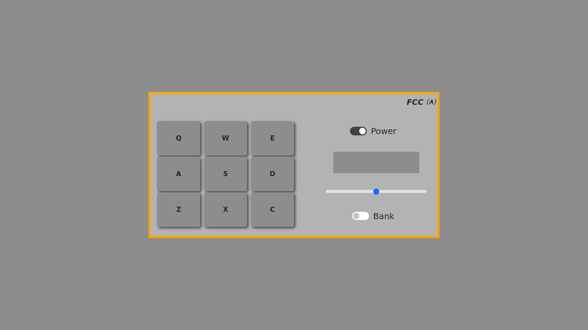
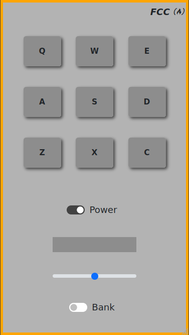

# Bateria eletrônica

Uma bateria eletrônica é apresentada nesta aplicação. Este projeto foi desenvolvido para obter a certificação em Bibliotecas de Desenvolvimento Front-End na plataforma freeCodeCamp.

##  :gear: Tecnologias

- HTML
- CSS
- JavaScript
- React
- Redux

##  :art: Layout

